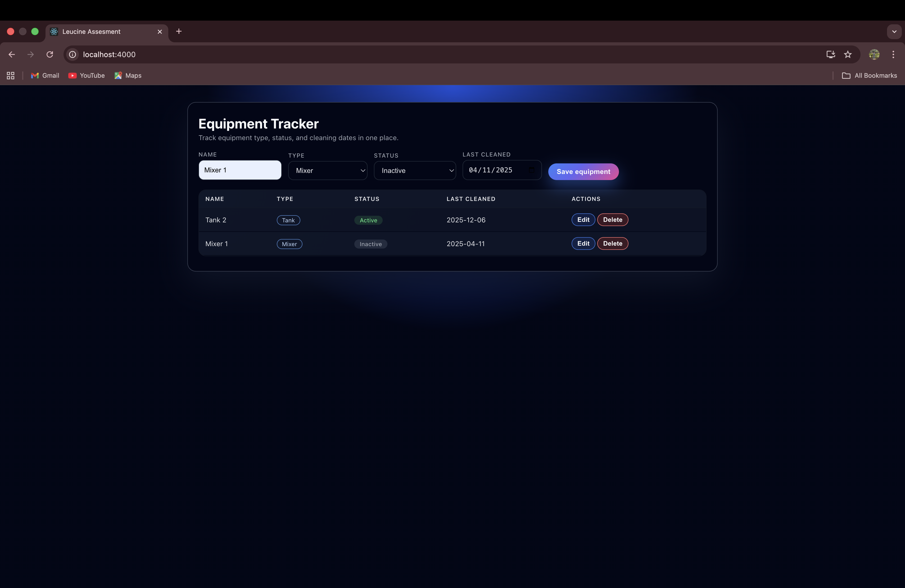

# CLEEN Equipment Tracker

A full-stack equipment tracking module inspired by enterprise pharmaceutical manufacturing systems. This project demonstrates CRUD functionality for managing equipment records with a focus on clean architecture and type safety.

---

## 🖼️ Frontend Preview




---

## 🧱 Tech Stack

### Frontend
- **React** (Functional Components, Hooks)
- **TypeScript** (Strict Typing)
- **Styled Components** (Modern UI/UX)

### Backend
- **Node.js & Express**
- **TypeScript**
- **TypeORM** (Object-Relational Mapping)

### Database
- **PostgreSQL**

---

## ✨ Features
- **Real-time CRUD**: Create, Read, Update, and Delete equipment.
- **Form Validation**: Ensures data integrity before submission.
- **Responsive Design**: Clean, dark-themed UI built with Styled Components.
- **Type Safety**: Shared interfaces between frontend and backend.
- **Status Indicators**: Visual badges for Active, Inactive, and Maintenance states.

---

## 📂 Project Structure
```text
cleen-equipment-tracker/
│
├── backend/
│   ├── src/
│   │   ├── config/          # Database configuration
│   │   ├── entities/        # TypeORM Models
│   │   ├── controllers/     # Request handling
│   │   └── services/        # Business logic
│   └── package.json
│
├── frontend/
│   ├── src/
│   │   ├── components/      # UI Components (Form, Table)
│   │   ├── styles/          # Styled Components / Theme
│   │   └── types/           # TypeScript Definitions
│   └── package.json
│
└── README.md